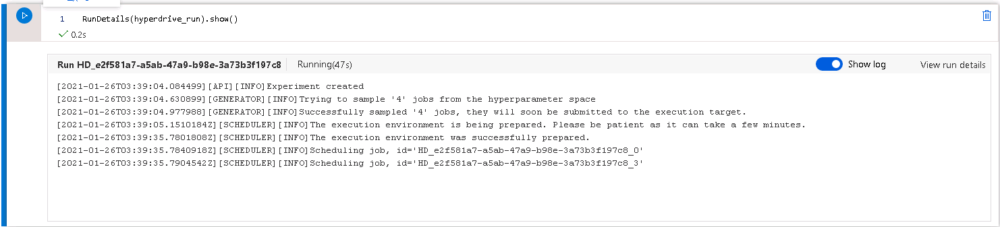
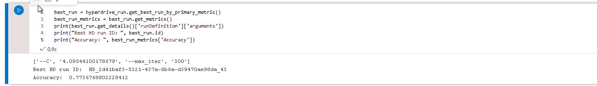
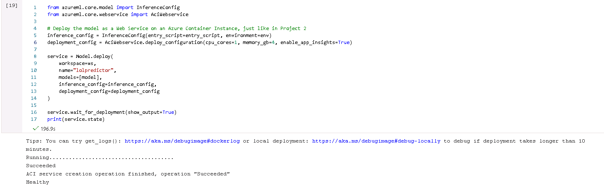
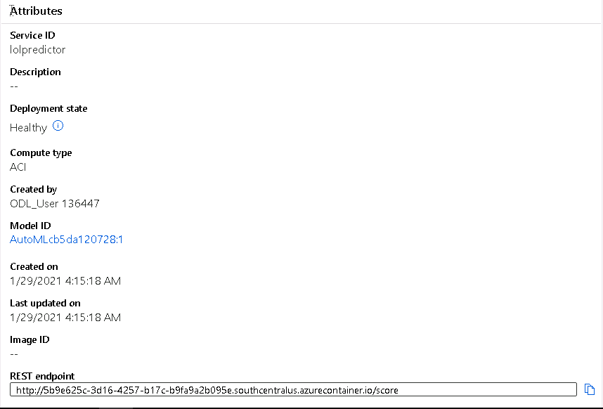

# Predicting League of Legends Pro Matches

League of Legends is a competitive 5v5 esport title and is the largest esport in the world. Every year, thousands of professional matches are played around the world. As part of Udacity's Machine Learning Engineer with Microsoft Azure Nanodegree Program, I applied the course knowledge on professional League of Legends esports matches and created a model to predict the outcome of a game given the game state at the ten-minute and fifteen-minute marks. The project calls to run two experiments: one with HyperDrive and another with AutoML. For each experiment, we evaluate the models by accuracy and save the best model. From here, we deploy one of the models to an endpoint before testing it by sending data as a JSON payload.
## Project Set Up and Installation
In order to set up and run this project in Azure ML Studio, run these steps:
1. All the necessary files are checked into the master branch of this repository, so you can either download the master branch as a ZIP or clone it.
2. Sign into Azure ML Studio and create a compute instance.
3. Go into the Notebooks section of Azure ML Studio and upload the Jupyter notebooks, Python scripts, and the "OraclesElixir_automl_data.csv" data file (used by AutoML).
4. On the first cell you run, you will need to authenticate using the code provided by the cell output.
5. After authenticating, you can start running the Jupyter notebook cells.
## Dataset

### Overview
The dataset I am using is a collection of 2020 match data courtesy of Tim "Magic" Sevenhuysen of Oracle's Elixir [can be accessed here](https://oracleselixir-downloadable-match-data.s3-us-west-2.amazonaws.com/2020_LoL_esports_match_data_from_OraclesElixir_20210126.csv). The dataset comprises of stats for not only teams, but also the individual players on each team. 

### Task
The objective of this project is to predict the outcome of professional League of Legends matches given early game data. In League of Legends, the early game is the first fifteen minutes of the game and the two most significant metrics used to determine game state are team gold difference and team experience (XP) difference. These are measured at ten minutes, fifteen minutes, and the end of the game. We also notice that there is a results column, with 0 for a loss and a 1 for a win. This makes our task a problem of classification. **NOTE: Much like in traditional sports, the natural variance given by the human element of League of Legends means that even with good statistics at ten/fifteen minutes, a victory is not guaranteed.**

### Access
We access the data for HyperDrive via the Oracle's Elixir website directly and use a 'cleaned' CSV file for AutoML. The 'cleaned' data has all non-imporant columns removed and has removed the entries for individual players. Our task calls for us to only use the 'team' entries.

## Automated ML
    experiment_timeout_minutes: 30: Defines the maximum amount of time the iterations can take before the experiment terminates.
    task="classification": Defines the task to be performed by AutoML.
    primary_metric: "accuracy": Defines the metric optimized for model selection.
    validation_size: 0.2: Specifies the proportion of the data that is held out for validation and testing.
    label_column_name: "result": The name of our label column (what our model will predict).
    
### Results
The best AutoML Model was a VotingEnsemble classifier with an accuracy of 75.13%. From looking at the notebook output, we see that this comprises of an ensemble of RandomForest, LightGBM, ExtremeRandomTrees, and LogisticRegression algorithms.


As stated earlier, teams that are ahead at ten and/or fifteen minutes do not always come out the victor. Teams can opt for strategies that are weak early in the game, yet become stronger later on in the game. Such characteristics are not easily captured through our dataset.

To improve our performance, while we are constrained by our domain and problem space, we can use deep learning or GPU resources to improve our experiment speed. We can also improve performance by including more features or by using cross-validations instead of holding out a part of the data as a validation set.

## Hyperparameter Tuning
I chose to use a LogisticRegression model with SKLearn to run a HyperDrive experiment with two parameters:
* C: Determines regularization strength. Higher C value means less regularization.
* Maximum # of Iterations: The maximum number of training iterations per child run.

For parameter sampling, I chose Bayesian sampling, which picks hyperparameter samples based on the performances of previous samples. Therefore, there is no need for an early termination policy. We can add more parameters to tune as well as apply the same suggested improvements as with the AutoML model. As with the AutoML model, we are constrained in our accuracy by domain and problem space.
### Results
The best HyperDrive run had an accuracy of 77.36%. The regularization strength was 4.0954 and the maximum number of iterations was 300.



## Model Deployment
In order to deploy a model as an endpoint, we follow these steps:
1. Save the trained model.
2. Provide configuration files such as the scoring script and environment files. If deploying an AutoML model as an endpoint, AutoML actually provides a scoring script in `outputs/scoring_file_v_1_0_0.py` that can be used as the entry script for the endpoint.
3. Technical details such as container type and resource allocation. Application Insights can also be enabled.

For this project, I deployed the AutoML model as an Azure Container Instance (ACI) with 1 CPU, 4 GB RAM, and application insights enabled.



To query our endpoint, we need to create a JSON object based on our scoring script as well as the Swagger JSON which functions as a schema. We then need the scoring URI (which can be accessed by the scoring_uri member of the Webservice class). We then create our POST request and send it to our endpoint like this:
```python
headers = {'Content-Type': 'application/json'}

response = requests.post(scoring_uri, input_data, headers=headers)
```
## Screen Recording
[Screencast link](https://youtu.be/WbFmuYzQSkw)
